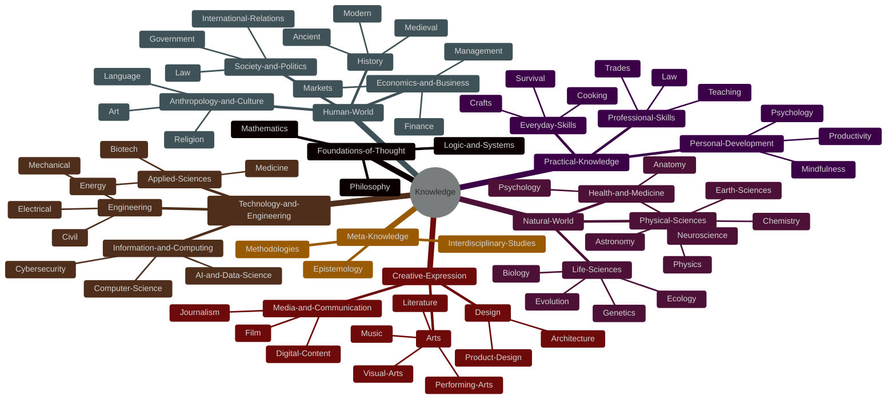

```mermaid
%%{init: {'theme':'dark'}}%%
mindmap
  root((Knowledge))
    Foundations-of-Thought
      Philosophy
      Mathematics
      Logic-and-Systems
    Natural-World
      Physical-Sciences
        Physics
        Chemistry
        Astronomy
        Earth-Sciences
      Life-Sciences
        Biology
        Ecology
        Genetics
        Evolution
      Health-and-Medicine
        Anatomy
        Neuroscience
        Psychology
    Human-World
      History
        Ancient
        Medieval
        Modern
      Anthropology-and-Culture
        Language
        Religion
        Art
      Society-and-Politics
        Law
        Government
        International-Relations
      Economics-and-Business
        Markets
        Finance
        Management
    Technology-and-Engineering
      Information-and-Computing
        Computer-Science
        AI-and-Data-Science
        Cybersecurity
      Engineering
        Mechanical
        Civil
        Electrical
      Applied-Sciences
        Medicine
        Biotech
        Energy
    Creative-Expression
      Arts
        Literature
        Music
        Visual-Arts
        Performing-Arts
      Design
        Architecture
        Product-Design
      Media-and-Communication
        Film
        Journalism
        Digital-Content
    Practical-Knowledge
      Everyday-Skills
        Cooking
        Crafts
        Survival
      Professional-Skills
        Law
        Teaching
        Trades
      Personal-Development
        Psychology
        Mindfulness
        Productivity
    Meta-Knowledge
      Epistemology
      Interdisciplinary-Studies
      Methodologies
```