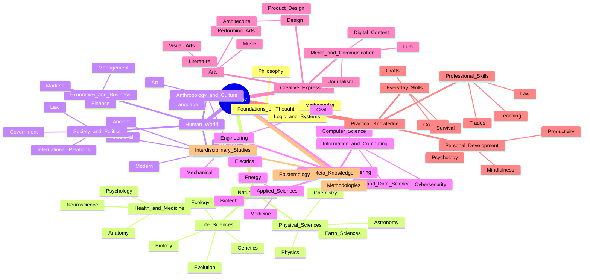

```mermaid
mindmap
  root((Knowledge))
    Foundations_of_Thought
      Philosophy
      Mathematics
      Logic_and_Systems
    Natural_World
      Physical_Sciences
        Physics
        Chemistry
        Astronomy
        Earth_Sciences
      Life_Sciences
        Biology
        Ecology
        Genetics
        Evolution
      Health_and_Medicine
        Anatomy
        Neuroscience
        Psychology
    Human_World
      History
        Ancient
        Medieval
        Modern
      Anthropology_and_Culture
        Language
        Religion
        Art
      Society_and_Politics
        Law
        Government
        International_Relations
      Economics_and_Business
        Markets
        Finance
        Management
    Technology_and_Engineering
      Information_and_Computing
        Computer_Science
        AI_and_Data_Science
        Cybersecurity
      Engineering
        Mechanical
        Civil
        Electrical
      Applied_Sciences
        Medicine
        Biotech
        Energy
    Creative_Expression
      Arts
        Literature
        Music
        Visual_Arts
        Performing_Arts
      Design
        Architecture
        Product_Design
      Media_and_Communication
        Film
        Journalism
        Digital_Content
    Practical_Knowledge
      Everyday_Skills
        Cooking
        Crafts
        Survival
      Professional_Skills
        Law
        Teaching
        Trades
      Personal_Development
        Psychology
        Mindfulness
        Productivity
    Meta_Knowledge
      Epistemology
      Interdisciplinary_Studies
      Methodologies
```